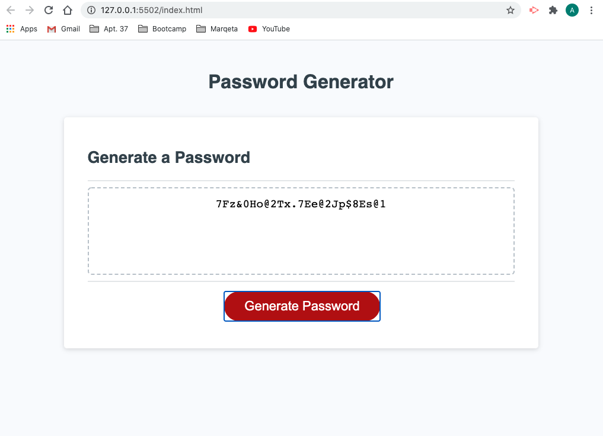

# Password Generator

## Repository

As hackers continue to breach private information, it's important to make your passwords unique and difficult to crack. Try not to use common phrases and public information, such as previous addresses or high school mascots. This password generator will create a strong random password for you. We'll need the desired number of characters, and from there you'll be asked if you'd like to include any of the following options:

<ul>
  <li>Numbers</li>
  <li>Uppercase Letters</li>
  <li>Lowercase Letters</li>
  <li>Special Characters</li>
</ul>

Below I'll include a screenshot of what the page looks like, with my newly generated password shown as an example.

Click [here](https://floressuarezalvaro.github.io/my_password_generator/) to access the generator.

## Contributing

The best way to participate in my portfolio is to [submit a bug](https://github.com/floressuarezalvaro/my_password_generator/issues). Additionally, you can review the [source code](https://github.com/floressuarezalvaro/my_password_generator/pulls) changes. Lastly, you can [build from the source itself](https://github.com/floressuarezalvaro/my_password_generator/wiki).
